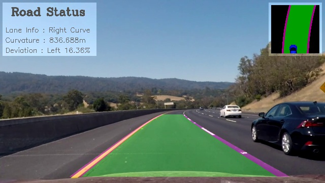
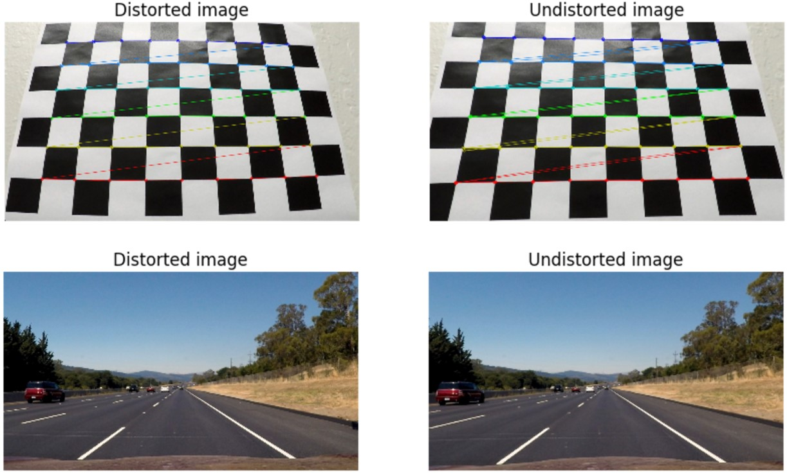
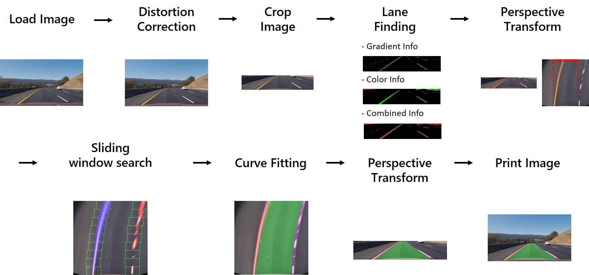
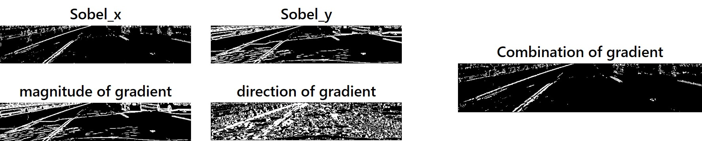
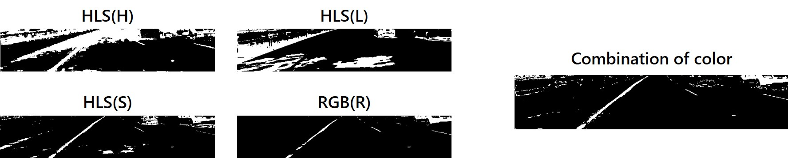
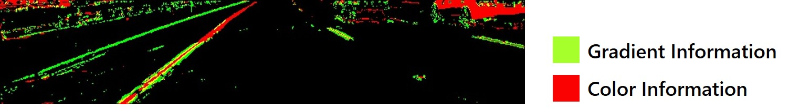
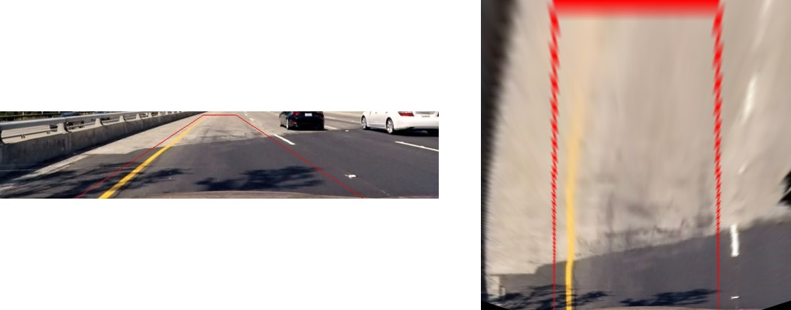

# Advanced Lane Finding Project  
  
  # 0.8로 바꿨는지

     
    <b>result image(watch the full video below)</b> 

## Introduction  
  
>This is **Advanced lane finding project** of Udacity's Self-Driving Car Engineering Nanodegree.
We already completed [lane finding project](https://github.com/windowsub0406/finding-lane-lines) in the first project. In that project, we could find lane lines and made robust algorighm for shadow and some of occlusion. It might be enough in the straight highway. But there are many curve lines in the road and that's why we need to detect curve lanes. In this project we'll find lane lines more specifically with computer vision.  
  
## Environment  
  
#### software  
  
>Windows 10(x64), Python 3.5, OpenCV 3.1.0

## Files
  
[`main.py`](main.py) : main code  
[`calibration.py`](calibration.py) : get calibration matrix  
[`threshold.py`](threshold.py) : sobel edge & hls color  
[`finding_lines.py`](finding_lines.py) : find & draw lane lines  
[`finding_lines_w.py`](finding_lines_w.py) : find & draw lane lines using weighted average method (for the 'challenge video')  

##The goals / steps of this project are the following:

* Compute the camera calibration matrix and distortion coefficients given a set of chessboard images.
* Apply a distortion correction to raw images.
* Use color transforms, gradients, etc., to create a thresholded binary image.
* Apply a perspective transform to rectify binary image ("birds-eye view").
* Detect lane pixels and fit to find the lane boundary.
* Determine the curvature of the lane and vehicle position with respect to center.
* Warp the detected lane boundaries back onto the original image.
* Output visual display of the lane boundaries and numerical estimation of lane curvature and vehicle position.

[//]: # (Image References)

[image1]: ./examples/undistort_output.png "Undistorted"
[image2]: ./test_images/test1.jpg "Road Transformed"
[image3]: ./examples/binary_combo_example.jpg "Binary Example"
[image4]: ./examples/warped_straight_lines.jpg "Warp Example"
[image5]: ./examples/color_fit_lines.jpg "Fit Visual"
[image6]: ./examples/example_output.jpg "Output"
[video1]: ./project_video.mp4 "Video"

---

##Camera Calibration

####When a camera looks at 3D objects in the real world and transforms them into a 2D image, it's not perfect because of a distortion. And the distortion brings an erroneous information.(e.g. changed object shape, bent lane lines) So, we have to undo the distortion for getting useful data. 

The code for camera calibration step is contained in the [`calibration.py`](calibration.py).  

I compute the camera matrix(intrinsic parameters) and distortion coefficients using the `cv2.calibrateCamera()` function with [20 9*6 sized chessboard images](camera_cal). And applied this distortion correction to the test image using the `cv2.undistort()` function.  
  

         

  
##Pipeline  
  

     
    <b>General Process</b> 

If an image loaded, we immediately undo distortion of the image using calculated calibration information.
  
###1. Crop Image

In image, a bonnet and background are not necessary to find lane lines. Therefore, I cropped the inconsequential parts.  
  
###2. Lane Finding  
  
I used two approaches to find lane lines.  
a **Gradient** approach and a **Color** approach.
The code for lane finding step is contained in the [`threshold.py`](threshold.py).  

In gradient approach, I applied Sobel operator in the x, y directions. And calculated magnitude of the gradient in both the x and y directions and direction of the gradient. I used red channel of RGB instead of grayscaled image.
And I combined them based on this code :
!!!!`asdfasdfasdfasdfasdfdafdsfasdf`  
  

     

  
  

In Color approach, I used red channel of RGB Color space and H,L,S channel of HSV Color space. Red color(255,0,0) is included in white(255,255,255) and yellow(255,255,0) color. That's way I used it. Also I used HLS Color space because we could be robust in brightness.  
I combined them based on this code :
!!!!`asdfasdfasdfasdfasdfdafdsfasdf`  
With this method, I could eliminate unnecessary shadow information.  

     

  
  
  
This is combination of color and gradient thresholds.  

     

  
  
  
###3. Perspective Transform  
  
Pick 4 points of straight lane lines and apply perspective transform to the lines look straight. It is also called `Bird's eye view`.  
  

     

  

####4. Sliding Window Search
Describe how (and identify where in your code) you identified lane-line pixels and fit their positions with a polynomial?

Then I did some other stuff and fit my lane lines with a 2nd order polynomial kinda like this:

![alt text][image5]

####5. Describe how (and identify where in your code) you calculated the radius of curvature of the lane and the position of the vehicle with respect to center.

I did this in lines # through # in my code in `my_other_file.py`

####6. Provide an example image of your result plotted back down onto the road such that the lane area is identified clearly.

I implemented this step in lines # through # in my code in `yet_another_file.py` in the function `map_lane()`.  Here is an example of my result on a test image:

![alt text][image6]

---

###Pipeline (video)

####1. Provide a link to your final video output.  Your pipeline should perform reasonably well on the entire project video (wobbly lines are ok but no catastrophic failures that would cause the car to drive off the road!).

Here's a [link to my video result](./project_video.mp4)

---

###Discussion

####1. Briefly discuss any problems / issues you faced in your implementation of this project.  Where will your pipeline likely fail?  What could you do to make it more robust?

Here I'll talk about the approach I took, what techniques I used, what worked and why, where the pipeline might fail and how I might improve it if I were going to pursue this project further.  
